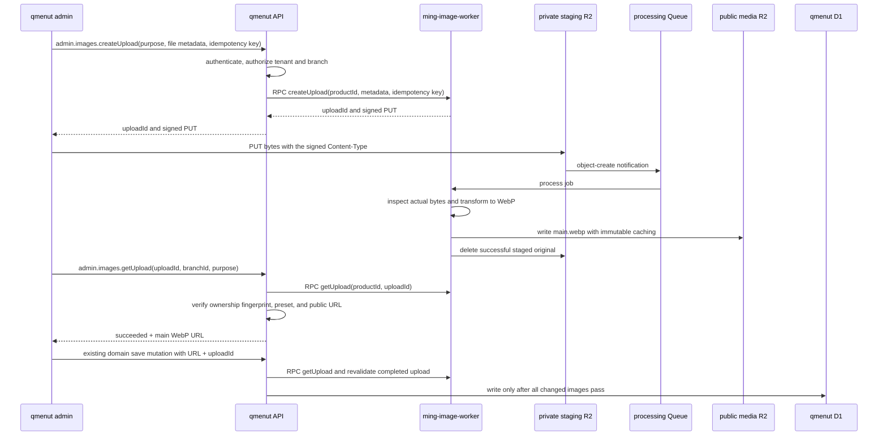

# Image uploads

qmenut uses `ming-image-worker` as a private, multi-product image upload and optimization
service. qmenut owns product authorization and database writes; the image Worker owns temporary
uploads, processing jobs, transformations, and output manifests.

## Status

The admin dashboard supports branch logos, a branch gallery of up to 20 photos, category images,
and dish images. JPEG, PNG, and WebP files up to 25 MiB are uploaded directly from the browser to
a private R2 staging bucket and converted asynchronously to a single public WebP variant.

No qmenut database migration is required. The existing `logo_url`, `branch_photos.url`, and
`image_url` columns continue to store URLs. qmenut does not duplicate the image Worker's job state.

## Responsibility boundary

qmenut owns:

- Better Auth sessions, tenant membership, branch authorization, and write permissions;
- the closed mapping from UI purpose to image-worker preset;
- client draft state, direct browser upload, polling, and retry presentation;
- verification that a successful upload belongs to the restaurant, branch, and purpose;
- atomic domain writes after every changed image has been verified.

`ming-image-worker` owns:

- product, preset, transform, bucket, key, and retention policy;
- idempotent upload jobs and 15-minute signed `PUT` URLs;
- D1 processing leases, attempts, stable failures, and manifests;
- R2 event consumption, Cloudflare Images transforms, output writes, and immediate staging cleanup;
- immutable cache metadata on optimized output objects.

The browser never calls the image Worker. qmenut's API reaches it through the private
`IMAGE_WORKER` service binding and its named `ImageRpc` entrypoint. The only browser-facing
infrastructure URL is the scoped, short-lived R2 `PUT` URL.

## End-to-end sequence



The admin keeps newly selected files local until the normal Save action. Uploads run with a
maximum concurrency of three. Status is polled every second for at most 90 seconds. A processed
draft retains its `uploadId` and URL if a later upload or D1 save fails, so another Save does not
upload it again.

## qmenut API contract

`admin.images.createUpload` accepts:

```ts
{
  branchId: string;
  purpose: "branchLogo" | "branchPhoto" | "categoryImage" | "dishImage";
  filename: string;
  contentType: "image/jpeg" | "image/png" | "image/webp";
  sizeBytes: number;
  idempotencyKey: string;
}
```

It returns the image Worker's `uploadId`, status, and signed upload details. Signed URLs must not
be logged, persisted, or sent to monitoring tools.

`admin.images.getUpload` accepts `branchId`, `purpose`, and `uploadId`. It returns:

```ts
{
  uploadId: string;
  status: "awaiting_upload" | "queued" | "processing" | "succeeded" | "failed";
  imageUrl: string | null;
  error: { code: string; message: string; retryable: boolean } | null;
}
```

`imageUrl` is non-null only for a successful manifest whose `main` variant is WebP and whose URL
has the `https://media.qmenut.app/.../main.webp` shape.

## Worker presets

The purpose mapping is closed in `apps/api`; browsers cannot send preset IDs or transforms.

| qmenut purpose  | Worker preset         | Output                                          |
| --------------- | --------------------- | ----------------------------------------------- |
| `branchLogo`    | `qmenut-logo`         | `main.webp`, width 512, scale-down, quality 90  |
| `branchPhoto`   | `qmenut-branch-photo` | `main.webp`, width 1600, scale-down, quality 84 |
| `categoryImage` | `qmenut-menu-image`   | `main.webp`, width 1024, scale-down, quality 82 |
| `dishImage`     | `qmenut-menu-image`   | `main.webp`, width 1024, scale-down, quality 82 |

All presets accept JPEG, PNG, and WebP up to 25 MiB. The signed URL lifetime is 15 minutes and
`retainOriginal` is false.

## Tenant and save-time verification

Before creating or polling an upload, the API verifies that the session's restaurant owns the
requested branch. Branch images require `branch.write`; menu images require `menu.write`.

The API hashes restaurant ID, branch ID, and purpose into the image Worker's `externalId`. Polling
and save-time validation recompute that fingerprint and also require the expected product and
preset. This makes an upload ID from another tenant, branch, or purpose unusable without adding a
qmenut upload table.

Every changed non-null image field must carry its successful `uploadId`. Immediately before the
domain write, the API re-fetches the worker job and requires the exact returned URL. Existing
external URLs may survive unrelated edits only when they match the current database value. New
entities and replacements cannot introduce arbitrary external URLs, including fabricated
`media.qmenut.app` URLs.

For the branch gallery, the API first accounts for the existing URL multiset, then validates every
new occurrence in parallel. Only after all validations succeed does the existing D1 batch replace
branch settings, schedules, and photos. A partial upload failure therefore leaves branch domain
data unchanged.

## Storage and delivery

| Resource                               | Access               | Purpose                                    |
| -------------------------------------- | -------------------- | ------------------------------------------ |
| `qmenut-image-staging`                 | Private              | Temporary originals and R2 event source    |
| `ming-image-processing-production`     | Private              | Shared processing and explicit retry Queue |
| `ming-image-processing-dlq-production` | Private              | Exhausted queue deliveries                 |
| `qmenut-media`                         | Public custom domain | Optimized WebP outputs                     |
| `https://media.qmenut.app`             | Public               | Stable image delivery origin               |

Configure `object-create` notifications only for `products/qmenut/uploads/`. Queue delivery is at
least once; worker leases, fenced completion, deterministic output keys, and idempotency keys make
duplicate notifications and repeated Save attempts safe.

This section is the canonical qmenut staging CORS policy. The staging bucket must allow browser
`PUT` requests with `Content-Type` from exactly:

- `https://admin.qmenut.app`;
- `https://admin.dev.qmenut.app`;
- `http://localhost:5174`.

All qmenut API environments currently bind `IMAGE_WORKER` with `remote: true`, including local
development and the E2E API. Uploading from localhost therefore uses the deployed shared worker,
staging bucket, processing queue, and media bucket; it is not an isolated test path. Do not add
upload E2E coverage until an isolated local worker or fake binding replaces that remote path.

Successful jobs delete originals immediately. A one-day lifecycle rule on the qmenut upload
prefix is the fallback for abandoned signed uploads, invalid images, failed jobs, and cleanup
failures. Cloudflare lifecycle deletion is asynchronous, so do not treat one day as an exact
deletion timestamp.

Provisioning commands and the checked-in CORS policy live in the sibling `ming-image-worker`
repository. Its `examples/qmenut-staging-cors.json` must match the canonical origins above; see the
sibling repository's `README.md` for the apply command.

## Error handling

The API parses both success and error envelopes and maps stable worker failures to tRPC errors.
Declared and actual media type/size are checked independently: a JPEG filename containing invalid
or unsupported bytes fails during processing and cannot reach a domain save.

The UI keeps each draft in one of these visible, live-announced states: ready, uploading,
optimizing, prepared, or failed. A timeout does not cancel the worker job; another Save uses the
same idempotency key and polls the existing job. A permanently failed job can be restarted from
the draft without losing the selected file.

Do not log signed URLs, source bytes, filenames, upload metadata values, or ownership fingerprints.

## Onboarding another product

1. Add a closed product policy and versioned presets in
   `ming-image-worker/src/config/image-policy.json`.
2. Add product-specific staging and output R2 bindings and runtime variables to the worker.
3. Add a storage-registry entry; never accept bucket names or transforms from the consumer.
4. Configure staging CORS, a prefix-filtered `object-create` notification, and lifecycle cleanup.
5. Connect a public custom domain if the consumer needs public manifest URLs.
6. Add a same-account service binding from the product backend to `ming-image-worker`.
7. Keep product authentication, ownership, polling, and database writes in that product.
8. Deploy the image Worker before the new caller and smoke-test the complete queue path.

## Deployment and smoke checks

Follow [Deployment](deployment.md) for the exact order. At minimum, verify:

1. JPEG, PNG, and WebP sources work for logo, gallery, category, and dish purposes.
2. Every saved URL is a public `main.webp` URL under `media.qmenut.app`.
3. Invalid bytes, unsupported formats, oversize files, expired signatures, queue failures,
   polling timeouts, and partial galleries leave qmenut domain data unchanged.
4. Cross-tenant IDs and fabricated qmenut media URLs are rejected.
5. Existing external URLs survive unrelated edits but cannot be introduced or changed manually.
6. Successful staging objects are deleted; abandoned objects show one-day lifecycle expiration.
7. Output objects have `Content-Type: image/webp` and
   `Cache-Control: public, max-age=31536000, immutable`.
8. Gallery ordering, keyboard controls, replacement, removal, mobile layout, and screen-reader
   status announcements work in the admin.

## Limitations

qmenut stores only URL references. Replacing an image or deleting its domain entity does not yet
delete the old optimized object from `qmenut-media`. Output garbage collection requires a future
reference-tracking or deletion capability and is intentionally outside this iteration.

There is no callback and no qmenut background upload table. The browser must poll while the Save
operation is active. Existing external assets are migrated only when an owner replaces them.

## Primary Cloudflare references

- [Service bindings](https://developers.cloudflare.com/workers/runtime-apis/bindings/service-bindings/)
- [R2 event notifications](https://developers.cloudflare.com/r2/buckets/event-notifications/)
- [R2 CORS for presigned URLs](https://developers.cloudflare.com/r2/buckets/cors/)
- [R2 object lifecycle rules](https://developers.cloudflare.com/r2/buckets/object-lifecycles/)
